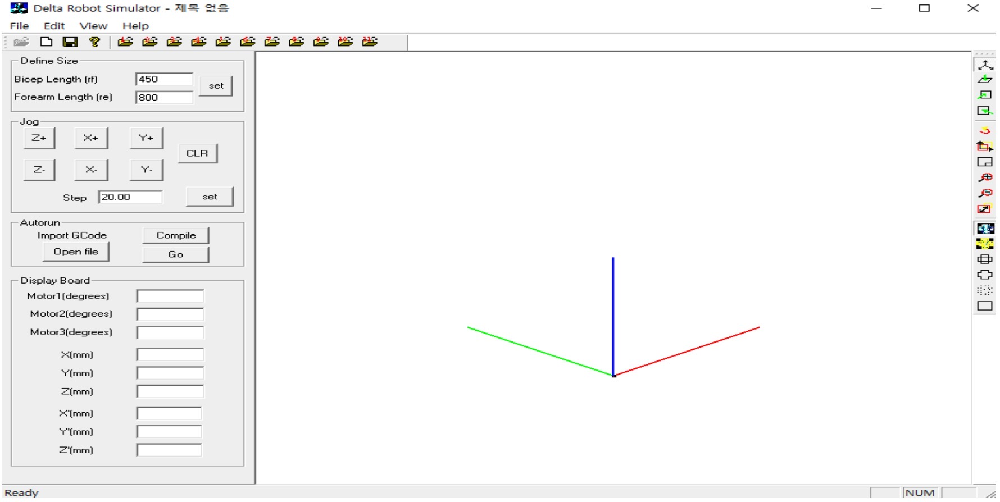
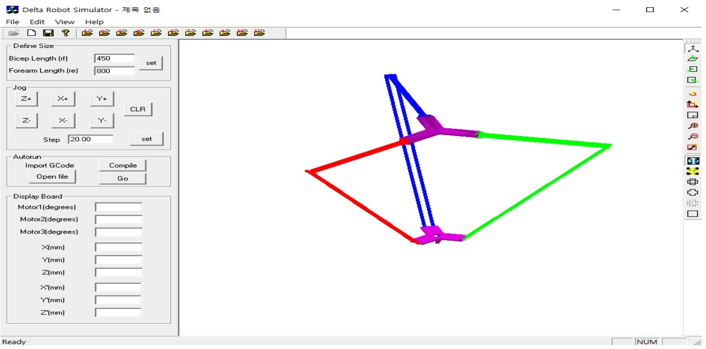
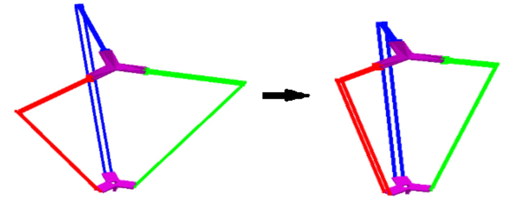
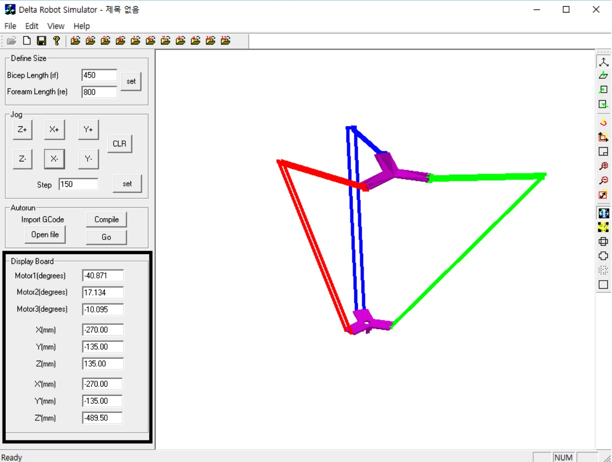
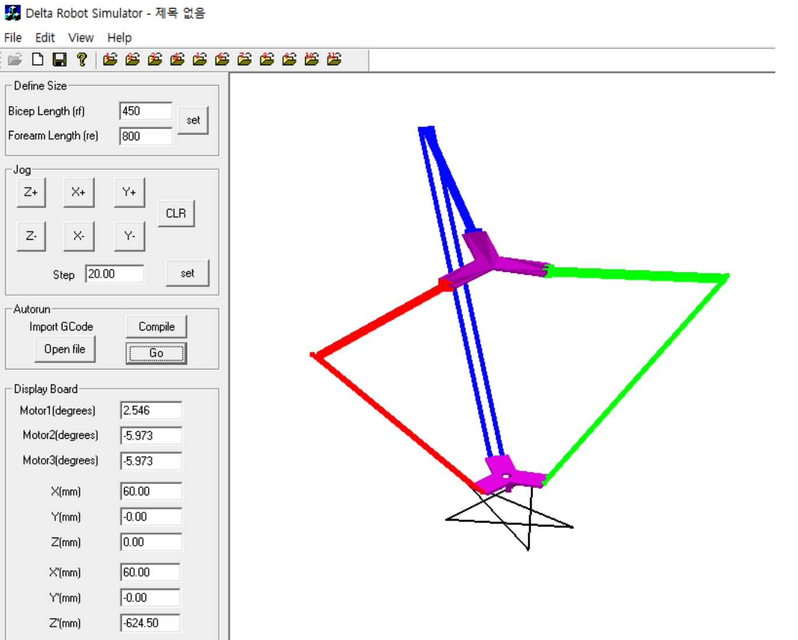

# delta_simu# Delta Robot Simulation and G-code Visualization Tool

This project provides a real-time animated simulation environment for Delta parallel robots. It is designed to support **researchers and developers** who need a customizable, desktop-based tool to test and validate Delta robot designs, jogging controls, and G-code movement paths with collision checking.

## Key Features

- **Customizable Delta Robot Design**
  - Supports user-defined base and end-effector STL models
  - Adjustable arm lengths (biceps and forearms) directly in GUI

- **Interactive Jogging Control**
  - Precise XYZ movement via step-controlled jogging buttons
  - Real-time feedback on joint angles (θ1, θ2, θ3) and geometry

- **G-code Simulation**
  - Supports standard G-code commands (G54, G00, G01, X/Y/Z, M02)
  - Visualizes effector path and simulates motion step-by-step
  - Enables pre-run collision check between robot and imported STL

- **Built-in Motion Smoothing**
  - Motion interpolated in multiple substeps to ensure fluid animation
  - Adjustable movement resolution for smoother paths

- **Sample Assets Included**
  - STL models for base and effector
  - Sample G-code files for motion validation and demonstration

## Interface Preview

>   
> *Initial interface upon startup*

>   
> *Delta robot assembled from base and effector STL + OpenGL arms*

>   
> *User-modified arm length dynamically updates robot geometry*

>   
> *Control effector position and view calculated joint angles*

>   
> *Effector follows G-code path with visual feedback*

## How to Use

1. Launch the executable from the `release/` folder.
2. Load your customized `.stl` files for base and effector.
3. Adjust robot parameters (arm lengths, jogging step size).
4. Use the Jogging Control panel or load a G-code file.
5. Visualize movement and ensure no collision occurs in simulation.

## Application Scope

This tool is ideal for:
- Researchers designing custom Delta robot configurations
- Engineers developing and validating G-code routines
- Educators demonstrating kinematics and path planning
- Makers testing 3D printer or pick-and-place prototypes

## Notes

- STL import currently supports fixed effector orientation (no rotation).
- Supports G-code parsing from `.txt` files up to 100 motion lines by default.

## Developer

**Yun Zhou (Robbie)**  
Background in Mechanical Engineering and Applied Data Science.  
Email: robbiezhou1@gmail.com
GitHub: [@Green-zy](https://github.com/Green-zy)

**Hanule Cho**
Mechanical Engineer
Email: coco8563@naver.com